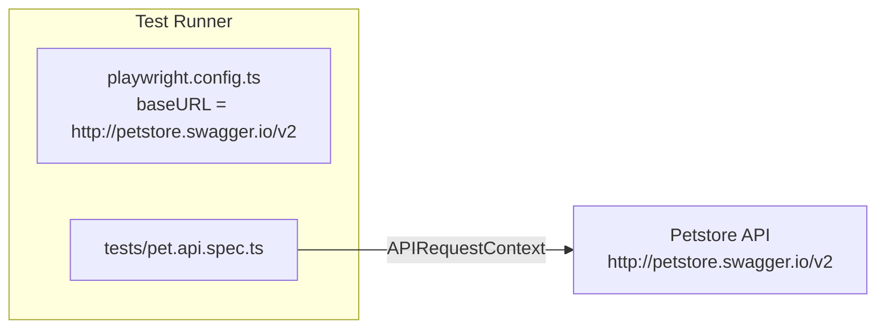

# Design Document: Petstore API Tests

## Overview

This design covers a Playwright API test suite targeting the [Swagger Petstore API](http://petstore.swagger.io/v2). The suite validates full CRUD operations on the `Pet` resource using Playwright's `APIRequestContext` — no browser is involved. Tests are written in TypeScript and run via `@playwright/test`.

The goals are:
- Verify correct HTTP status codes for happy-path and error scenarios
- Verify response body field values match request payloads
- Verify round-trip consistency (create → read, update → read, delete → read returns 404)
- Keep configuration centralised in `playwright.config.ts`

---

## Architecture



All tests share a single Playwright project configured for API-only usage (no browser devices). The `request` fixture provided by `@playwright/test` is used directly; no custom fixture wrappers are required for this scope.

Test isolation is achieved by generating a unique numeric `id` per test run (using `Date.now()`), so concurrent or repeated runs do not collide on the same Pet_ID.

---

## Components and Interfaces

### playwright.config.ts (modified)

- Sets `baseURL: 'http://petstore.swagger.io/v2'`
- Removes browser-specific projects; adds a single `api` project with no `use.browserName`
- Sets `testDir: './tests'`

### tests/pet.api.spec.ts (new file)

Single spec file containing four `test.describe` blocks, one per CRUD operation:

| Describe block | HTTP method | Endpoint |
|---|---|---|
| `POST /pet` | POST | `/pet` |
| `GET /pet/{petId}` | GET | `/pet/{petId}` |
| `PUT /pet` | PUT | `/pet` |
| `DELETE /pet/{petId}` | DELETE | `/pet/{petId}` |

Each test uses the `request` fixture from `@playwright/test`. POST and PUT requests include `Content-Type: application/json`.

### Helper: `buildPet(id: number)`

A small inline factory function that returns a `Pet` object conforming to the Petstore schema. Keeps payload construction DRY across tests.

```typescript
function buildPet(id: number): Pet {
  return {
    id,
    name: `TestPet-${id}`,
    status: 'available',
    photoUrls: ['https://example.com/photo.jpg'],
  };
}
```

---

## Data Models

### Pet (TypeScript interface)

```typescript
interface Category {
  id?: number;
  name?: string;
}

interface Tag {
  id?: number;
  name?: string;
}

interface Pet {
  id?: number;
  category?: Category;
  name: string;           // required
  photoUrls: string[];    // required
  tags?: Tag[];
  status?: 'available' | 'pending' | 'sold';
}
```

### ApiResponse (used by DELETE)

```typescript
interface ApiResponse {
  code: number;
  type: string;
  message: string;
}
```

These interfaces are defined inline in the spec file (no separate types file needed for this scope).

---


## Correctness Properties

*A property is a characteristic or behavior that should hold true across all valid executions of a system — essentially, a formal statement about what the system should do. Properties serve as the bridge between human-readable specifications and machine-verifiable correctness guarantees.*

### Property 1: POST creates a pet with correct fields

*For any* valid pet body (with a unique id, a non-empty name, and at least one photo URL), sending a POST to `/pet` should return status 200 and a response body whose `name` matches the request and whose `id` is a number.

**Validates: Requirements 1.1, 1.2, 1.3**

---

### Property 2: Create → Read round-trip

*For any* pet that was successfully created via POST, a subsequent GET to `/pet/{petId}` should return status 200 and a body whose `id` equals the requested Pet_ID and whose `name` matches the name used at creation.

**Validates: Requirements 2.1, 2.2, 2.3**

---

### Property 3: Update → Read round-trip

*For any* pet that exists, sending a PUT with an updated name and then a GET for the same Pet_ID should return the updated name and the same Pet_ID — confirming the API persisted the change.

**Validates: Requirements 3.1, 3.2, 3.3, 3.4**

---

### Property 4: Delete → Read returns 404

*For any* pet that was successfully created and then deleted via DELETE (which returns 200), a subsequent GET for that Pet_ID should return status 404.

**Validates: Requirements 4.1, 4.2**

---

### Property 5: GET non-existent pet returns 404 (edge case)

*For any* Pet_ID that was never created (or has been deleted), a GET request to `/pet/{petId}` should return status 404.

**Validates: Requirements 2.4**

---

### Property 6: POST with malformed body returns 4xx (edge case)

*For any* malformed (non-JSON or structurally invalid) request body sent to POST `/pet`, the API should return a 4xx status code.

**Validates: Requirements 1.4**

---

## Error Handling

| Scenario | Expected behaviour | Requirement |
|---|---|---|
| POST with malformed JSON | API returns 4xx; test asserts `response.status() >= 400 && < 500` | 1.4 |
| GET with non-existent Pet_ID | API returns 404; test asserts `response.status() === 404` | 2.4 |
| GET after DELETE | API returns 404; test asserts `response.status() === 404` | 4.2 |

Tests do not attempt to recover from unexpected 5xx responses from the live API — those are treated as test failures and surfaced in the Playwright report.

Because the Petstore API is a shared public sandbox, tests use `Date.now()` as the Pet_ID to minimise collision risk. Tests are not retried on 404 during setup; if the API is unavailable the suite fails fast.

---

## Testing Strategy

### Dual Testing Approach

Both unit/example tests and property-based tests are used:

- **Example tests** — specific, deterministic scenarios that verify concrete behaviour (e.g., a single known pet payload). Good for integration points and error conditions.
- **Property-based tests** — universally quantified assertions run across many generated inputs. Used to verify that the properties above hold for arbitrary valid (and invalid) inputs.

### Property-Based Testing Library

[fast-check](https://github.com/dubzzz/fast-check) is the chosen PBT library for TypeScript. It integrates cleanly with `@playwright/test` via `fc.assert(fc.asyncProperty(...))`.

Install:
```bash
npm install --save-dev fast-check
```

Each property test must run a minimum of **100 iterations** (`numRuns: 100`).

### Test File Structure

```
tests/
  pet.api.spec.ts   ← all CRUD tests (example + property-based)
```

### Property Test Tag Format

Each property-based test must include a comment referencing the design property:

```
// Feature: petstore-api-tests, Property <N>: <property_text>
```

### Property Test Sketches

**Property 1 — POST creates a pet with correct fields**
```typescript
// Feature: petstore-api-tests, Property 1: POST creates a pet with correct fields
await fc.assert(
  fc.asyncProperty(
    fc.record({ name: fc.string({ minLength: 1 }), id: fc.integer({ min: 1e9, max: 2e9 }) }),
    async ({ name, id }) => {
      const res = await request.post('/pet', { data: buildPet(id, name), headers: { 'Content-Type': 'application/json' } });
      expect(res.status()).toBe(200);
      const body = await res.json();
      expect(typeof body.id).toBe('number');
      expect(body.name).toBe(name);
    }
  ),
  { numRuns: 100 }
);
```

**Property 2 — Create → Read round-trip**
```typescript
// Feature: petstore-api-tests, Property 2: Create → Read round-trip
// Generate a pet, POST it, then GET it and verify id + name
```

**Property 3 — Update → Read round-trip**
```typescript
// Feature: petstore-api-tests, Property 3: Update → Read round-trip
// POST a pet, PUT with a new name, GET and verify updated name
```

**Property 4 — Delete → Read returns 404**
```typescript
// Feature: petstore-api-tests, Property 4: Delete → Read returns 404
// POST a pet, DELETE it, GET and verify 404
```

**Property 5 — GET non-existent returns 404 (edge case)**
```typescript
// Feature: petstore-api-tests, Property 5: GET non-existent pet returns 404
// Use fc.integer in a range unlikely to exist; assert 404
```

**Property 6 — POST malformed body returns 4xx (edge case)**
```typescript
// Feature: petstore-api-tests, Property 6: POST malformed body returns 4xx
// Use fc.string() as raw body; assert status >= 400
```

### Unit / Example Tests

Complement property tests with at least one concrete example per CRUD operation to serve as a readable smoke test and to cover the specific field assertions in requirements 1–4.

### Test Configuration Notes

- `playwright.config.ts` must set `baseURL: 'http://petstore.swagger.io/v2'` and use a single `api` project (no browser devices).
- All POST/PUT requests must include `'Content-Type': 'application/json'`.
- No `beforeAll`/`afterAll` global state — each test is self-contained.
